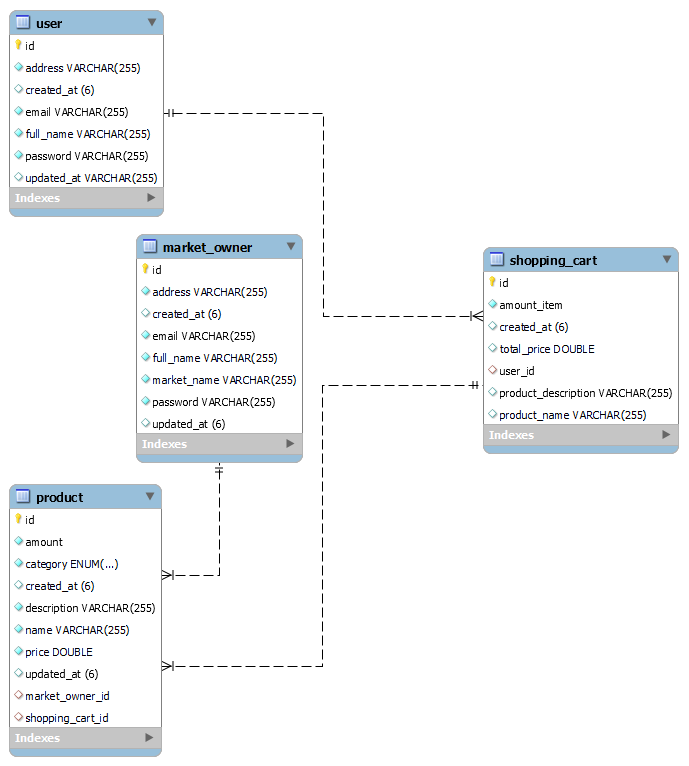

# Starting

In the application scenario, it is the rest API where the seller and the buyer are present and the buyer can make a simple purchase.

## Uploading

    Clone the project's GitHub repository: 
    
    
    Go to the project directory:
    cd shopping
    
    Run the following Maven command to install the dependencies:
    mvn install
    
    Run the following command to start the application:
    mvn spring-boot:run
    
    By default the application will run at http://localhost:8080

  -  Represents sql relationships

## Licence

[MIT](https://choosealicense.com/licenses/mit/)

## Used technologies
- Spring Boot
- Maven
- Spring Data JPA
- Spring Validation
- Spring Web
- MySQL
- Lombok